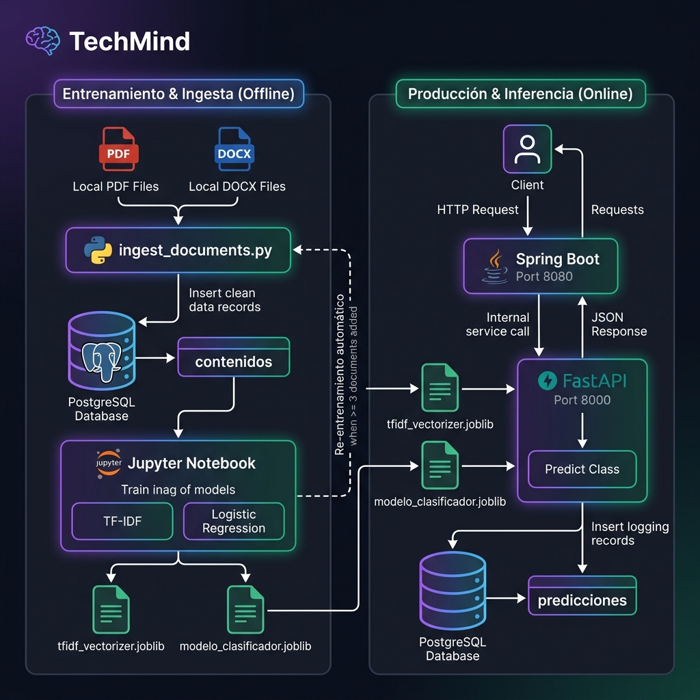

<div align="center">

# 🧠 TechMind
### Organización Inteligente del Conocimiento Técnico

[](https://www.python.org/)
[](https://scikit-learn.org/)
[](https://www.postgresql.org/)
[](https://jupyter.org/)
[](https://www.oracle.com/cloud/)
[](https://github.com/No-Country-simulation/g9-latam-techmind-team37)

**Hackathon TechMind · G9 LATAM · Equipo 37**

</div>

---

## 📌 ¿Qué es TechMind?

TechMind es un sistema de **organización inteligente de contenido técnico**. Dado el título y texto de un artículo, documentación o apunte técnico, el sistema responde automáticamente con:

- 📂 La **categoría temática** del contenido (Backend, Data Science, DevOps, etc.)
- 📊 La **probabilidad** de esa clasificación
- 🔑 Las **palabras clave** más relevantes del texto

Todo en formato JSON, listo para ser consumido por la API REST del equipo.

```json
{
  "categoria": "Backend",
  "probabilidad": 0.8879,
  "informaciones_adicionales": ["spring boot", "java", "api rest", "creación apis", "spring"]
}
```

---

## 🏗️ Arquitectura del Proyecto

```
   Cliente / Usuario (Navegador)
               │
               │  POST /contenido  (http://localhost:5173)
               ▼
  ┌─────────────────────────────────────────┐
  │   Frontend Web (HTML5 + TailwindCSS)    │
  │   Diseño Cyber AI Glassmorphism         │
  └────────────────────┬────────────────────┘
                       │  HTTP POST /contenido
                       ▼
  ┌─────────────────────────────────────────┐
  │   Spring Boot — Puerto 8080 (CORS ON)   │
  └────────────────────┬────────────────────┘
                       │  HTTP interno POST /predecir
                       ▼
  ┌─────────────────────────────────────────┐
  │   FastAPI (Python) — Puerto 8000        │
  │   TF-IDF (3000 max_feat) + LogReg       │
  │   Dataset: 221 registros (Accuracy 86.7%)│
  └────────────────────┬────────────────────┘
                       │
                       ▼
  ┌─────────────────────────────────────────┐
  │   PostgreSQL 16 — Puerto 5432           │
  │   contenidos · predicciones             │
  └─────────────────────────────────────────┘
```

| Componente | Tecnología | Responsable |
|-----------|-----------|-------------|
| **Frontend Web** | HTML5 · TailwindCSS v3 · JS Vanilla (Stitch UI) | Ernesto Llampa · Equipo DS |
| **Ciencia de Datos** | Python · Scikit-Learn · FastAPI | Leandro Villamil · Ernesto Llampa · Romulo Garcia Maygua |
| **Back-End** | Java · Spring Boot · Flyway | Sergio Pablo Vilte · Andres Felipe Rojas · Noelia Rementeria · Camila Fagina |
| **Quality Assurance** | Postman · Swagger · Manual Testing · Git | Federico Gutierrez |
| **Nube** | Oracle Cloud Infrastructure (OCI) | Todo el equipo |

---

## 📁 Estructura del Repositorio

```
g9-latam-techmind-team37/
│
├── app/                                   # Microservicio FastAPI (Backend Python)
│   ├── __init__.py
│   ├── main.py                            # API REST: /predecir, /health, /categorias, /predicciones
│   └── database.py                        # Conexión PostgreSQL y registro de predicciones
│
├── frontend/                              # Módulo Frontend Web (Stitch UI)
│   ├── index.html                         # Plantilla Cyber AI Dark Mode Glassmorphism
│   ├── app.js                             # Lógica cliente JS, Health checks, POST y Modal BD
│   └── README.md                          # Documentación del módulo web
│
├── documentos/                            # PDFs / DOCXs para ingesta masiva
│
├── data-science/                          # Módulo de Ciencia de Datos y Machine Learning
│   ├── data/
│   │   ├── raw/
│   │   │   └── contenidos_tecnicos.csv    # Dataset ampliado de entrenamiento (221 registros)
│   │   └── processed/                     # Datos procesados / intermedios
│   ├── notebooks/
│   │   └── TechMind_DataScience.ipynb     # Notebook Jupyter principal
│   ├── src/
│   │   ├── ingest_documents.py            # Script para ingestión de PDFs/DOCXs
│   │   ├── expand_and_train.py            # Script de expansión de dataset y reentrenamiento
│   │   └── migrate_to_postgres.py         # Script de migración CSV -> PostgreSQL
│   ├── models/
│   │   ├── modelo_clasificador.joblib     # Modelo binario serializado (LogReg balanced)
│   │   └── tfidf_vectorizer.joblib        # Vectorizador TF-IDF serializado (3000 max_feat)
│   ├── docs/                              # Documentación técnica de Data Science
│   │   ├── BACKEND_INTEGRATION.md
│   │   ├── DIAGRAMA_PIPELINE.md
│   │   ├── INGESTA_DOCUMENTOS.md
│   │   ├── EXPLICACION_PROYECTO.md
│   │   ├── BUGFIX_CHANGELOG.md
│   │   ├── ROADMAP_MEJORAS.md
│   │   └── REQUIREMENTS.md
│   ├── assets/
│   │   └── pipeline_flowchart.png        # Diagrama de flujo del pipeline
│   ├── requirements.txt                  # Dependencias de Python
│   └── README.md                         # Documentación específica del módulo DS
│
├── qa/                                   # Módulo de Quality Assurance
│   ├── casos-de-prueba/                  # Documentación de diseño de pruebas
│   │   └── (v1.2) Matriz de Casos de Prueba – Sprint 1.xlsx          
│   ├── evidencias/                       # Respaldos y ejecuciones de las pruebas
│   │   ├── capturas/                     
│   │   └── respuestas-json/
│   ├── reportes/                         # Informes y resultados finales
│   │   ├── informes/
│   │   │   └── (v1.2) Matriz de Casos de Prueba – Sprint 1.xlsx
│   │   └── resultados-sprint-1.md        # Resumen ejecutivo de métricas, bugs encontrados y estado de ejecución del Sprint 1
│   └── README.md                         # Documentación específica del módulo QA
│
├── docker-compose.yml                    # Servidor PostgreSQL 16
├── setup.py                              # Script automático de instalación y arranque del stack completo
├── how-to-run.md                         # Guía paso a paso para el equipo de Backend y Fullstack
├── .env.example                          # Plantilla de variables de entorno
├── .gitignore                            # Filtro de archivos para Git/GitHub
└── README.md                             # Documentación principal del repositorio
```

---

## 🚀 Cómo ejecutar el proyecto

### Opción rápida — Script automático (recomendado)

```bash
# Primera vez — instala todo y arranca
python setup.py

# Las veces siguientes
python setup.py --start
```

> Ver la guía completa paso a paso en [`how-to-run.md`](how-to-run.md) (especialmente útil para el equipo de Backend en Windows).

### Pasos manuales

#### 1. Clonar el repositorio

```bash
git clone https://github.com/No-Country-simulation/g9-latam-techmind-team37.git
cd g9-latam-techmind-team37
```

#### 2. Crear entorno virtual e instalar dependencias

```bash
python3 -m venv venv
source venv/bin/activate          # macOS / Linux
# venv\Scripts\activate           # Windows

pip install -r data-science/requirements.txt
```

#### 3. Levantar PostgreSQL con Docker

```bash
docker-compose up -d
# PostgreSQL disponible en localhost:5432
```

#### 4. Levantar la API Spring Boot (crea las tablas con Flyway)

```bash
cd backend/api/api
./mvnw spring-boot:run
```

#### 5. Configurar variables de entorno y migrar datos

En otra terminal con el entorno Python activo:

```bash
cp .env.example .env
python3 data-science/src/migrate_to_postgres.py
```

#### 6. Iniciar la API FastAPI

```bash
uvicorn app.main:app --reload --port 8000
```

#### 7. Iniciar el Frontend Web UI

En una tercera terminal:

```bash
python3 -m http.server 5173 --directory frontend
```

Abrí en tu navegador:
👉 **[http://localhost:5173](http://localhost:5173)**

---

## 🧪 Pipeline de Ciencia de Datos



| Paso | Descripción | Función / Herramienta |
|------|-------------|----------------------|
| 1 | **Carga de datos** desde PostgreSQL (`contenidos`) | `pd.read_sql_query()` |
| 2 | **EDA** — distribución de categorías, longitud de textos, nulos | `matplotlib` / `seaborn` |
| 3 | **Preprocesamiento** — minúsculas, remover puntuación, stopwords | `limpiar_texto()` |
| 4 | **Vectorización TF-IDF** — unigramas y bigramas, max 1500 features | `TfidfVectorizer` |
| 5a | **Entrenamiento** — Regresión Logística balanceada | `LogisticRegression` |
| 5b | **Extracción de keywords** — top 5 tokens por peso TF-IDF | `extraer_keywords()` |
| 6 | **Evaluación** — accuracy, precision/recall/F1 | `classification_report` |
| 7 | **Serialización** de artefactos en `data-science/models/` | `joblib.dump()` |

> Ver [`data-science/docs/DIAGRAMA_PIPELINE.md`](data-science/docs/DIAGRAMA_PIPELINE.md) para el diagrama interactivo Mermaid.

---

## 📬 Contrato de la API

### Endpoint: `POST /predecir`

**Request:**
```json
{
  "titulo": "Introducción a Spring Boot",
  "texto": "Conceptos básicos para la creación de APIs REST con Java y Spring Boot."
}
```

**Response:**
```json
{
  "categoria": "Backend",
  "probabilidad": 0.8879,
  "informaciones_adicionales": ["spring boot", "java", "api rest", "creación apis", "spring"]
}
```

---

## 📚 Documentación Técnica

- Guía de arranque para Backend (Windows): [`how-to-run.md`](how-to-run.md)
- Guía de integración Java/Spring Boot: [`data-science/docs/BACKEND_INTEGRATION.md`](data-science/docs/BACKEND_INTEGRATION.md)
- Guía de entrenamiento y ejecución del modelo: [`data-science/docs/ENTRENAMIENTO_Y_EJECUCION.md`](data-science/docs/ENTRENAMIENTO_Y_EJECUCION.md)
- Ingesta de documentos PDF/DOCX: [`data-science/docs/INGESTA_DOCUMENTOS.md`](data-science/docs/INGESTA_DOCUMENTOS.md)
- Diagrama interactivo del pipeline: [`data-science/docs/DIAGRAMA_PIPELINE.md`](data-science/docs/DIAGRAMA_PIPELINE.md)
- Explicación conceptual para presentaciones: [`data-science/docs/EXPLICACION_PROYECTO.md`](data-science/docs/EXPLICACION_PROYECTO.md)
- Requerimientos técnicos: [`data-science/docs/REQUIREMENTS.md`](data-science/docs/REQUIREMENTS.md)
- Historial de cambios: [`data-science/docs/CHANGELOG.md`](data-science/docs/CHANGELOG.md)
- Documentación y Reportes de QA: [`qa/README.md`](qa/README.md)

---

<div align="center">

**TechMind · Hackathon G9 LATAM · Equipo 37**

</div>
