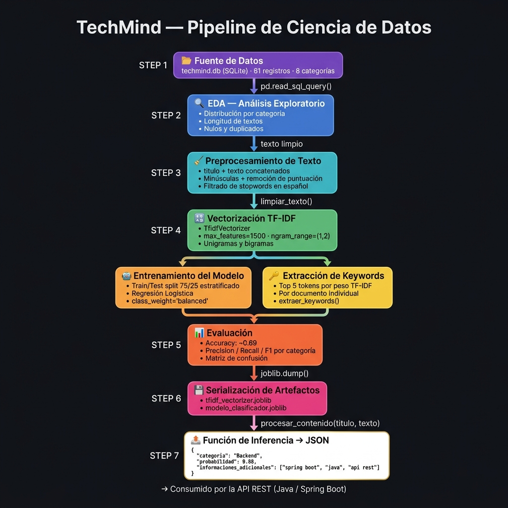

<div align="center">

# 🧠 TechMind
### Organización Inteligente del Conocimiento Técnico

[](https://www.python.org/)
[](https://scikit-learn.org/)
[](https://www.postgresql.org/)
[](https://jupyter.org/)
[](https://www.oracle.com/cloud/)
[](https://github.com/ernes2111/G9-Tech-mind-Team-37)
[](https://github.com/ernes2111/G9-Tech-mind-Team-37)

**Hackathon TechMind · G9 LATAM · Equipo 37**

</div>

---

## 📌 ¿Qué es TechMind?

TechMind es un sistema de **organización inteligente de contenido técnico**. Dado el título y texto de un artículo, documentación o apunte técnico, el sistema responde automáticamente con:

- 📂 La **categoría temática** del contenido (Backend, Data Science, DevOps, etc.)
- 📊 La **probabilidad** de esa clasificación
- 🔑 Las **palabras clave** más relevantes del texto

Todo en formato JSON, listo para ser consumido por la API REST del equipo.

```json
{
  "categoria": "Backend",
  "probabilidad": 0.8879,
  "informaciones_adicionales": ["spring boot", "java", "api rest", "creación apis", "spring"]
}
```

---

## 🏗️ Arquitectura del Proyecto

```
  Postman / Cliente
       │  POST /contenido
       ▼
┌──────────────────────────────────┐
│   Spring Boot — Puerto 8080      │
└───────────────┬──────────────────┘
                │  HTTP interno POST /predecir
                ▼
┌──────────────────────────────────┐
│   FastAPI (Python) — Puerto 8000 │
│   TF-IDF + Regresión Logística   │
└──────────┬───────────────────────┘
           │
           ▼
┌──────────────────────────────────┐
│   PostgreSQL — Puerto 5432       │
│   contenidos · predicciones      │
└──────────────────────────────────┘
```

| Componente | Tecnología | Responsable |
|-----------|-----------|-------------|
| **Ciencia de Datos** | Python · Scikit-Learn · FastAPI | Ernesto |
| **Back-End** | Java · Spring Boot | Equipo Backend |
| **Nube** | Oracle Cloud Infrastructure (OCI) | Todo el equipo |

---

## 📁 Estructura del Repositorio

```
TechMind - G9 - LATAM - TEAM 37/
│
├── 📓 TechMind_DataScience.ipynb   # Notebook principal — pipeline completo
├── 📋 contenidos_tecnicos.csv      # Dataset de entrenamiento (fuente de seed)
├── 🔧 migrate_to_postgres.py       # Script de migración CSV → PostgreSQL
│
├── ⚡ app/
│   ├── __init__.py
│   ├── main.py                     # FastAPI — endpoints /predecir /health /categorias
│   └── database.py                 # Conexión PostgreSQL y log de predicciones
│
├── 🐳 docker-compose.yml           # PostgreSQL 16 local (un solo comando)
├── 🔐 .env.example                 # Plantilla de variables de entorno
├── 📊 pipeline_flowchart.png       # Diagrama visual del pipeline v0.4
│
├── 📄 README.md                    # Este archivo
├── 📄 BACKEND_INTEGRATION.md       # Guía completa para el equipo Java/Spring Boot
├── 📄 REQUIREMENTS.md              # Dependencias detalladas con descripción
├── 📄 CHANGELOG.md                 # Historial de versiones
├── 📄 ROADMAP.md                   # Mejoras planificadas y bugs conocidos
├── 📄 DIAGRAMA_PIPELINE.md         # Diagrama interactivo (Mermaid) + tabla de pasos
├── 📄 EXPLICACION_PROYECTO.md      # Explicación no técnica para presentaciones
│
└── 📦 requirements.txt             # Dependencias pip
```

> **Nota:** `tfidf_vectorizer.joblib` y `modelo_clasificador.joblib` se generan localmente al
> ejecutar el notebook. No están versionados en el repositorio.

---

## 🚀 Cómo ejecutar el proyecto

### 1. Clonar el repositorio

```bash
git clone https://github.com/ernes2111/G9-Tech-mind-Team-37.git
cd G9-Tech-mind-Team-37
```

### 2. Crear entorno virtual e instalar dependencias

```bash
python3 -m venv venv
source venv/bin/activate          # macOS / Linux
# venv\Scripts\activate           # Windows

pip install -r requirements.txt
```

### 3. Levantar PostgreSQL con Docker

```bash
docker-compose up -d
# PostgreSQL disponible en localhost:5432
```

### 4. Configurar variables de entorno y migrar datos

```bash
cp .env.example .env
python3 migrate_to_postgres.py
```

### 5. Ejecutar el notebook (genera los modelos)

```bash
jupyter notebook TechMind_DataScience.ipynb
```

Ejecutar todas las celdas de arriba hacia abajo. Al finalizar se generarán:
- `tfidf_vectorizer.joblib`
- `modelo_clasificador.joblib`

### 5. Verificar el entorno

```python
import sys, importlib

requeridos = {"pandas": "2.2.0", "numpy": "1.26.0", "sklearn": "1.4.0",
              "joblib": "1.3.0", "matplotlib": "3.8.0", "seaborn": "0.13.0"}

for mod, minver in requeridos.items():
    m = importlib.import_module(mod)
    ver = getattr(m, "__version__", "?")
    print(f"{'✅' if ver >= minver else '⚠️'} {mod:15} {ver}")
```

---

## 🧪 Pipeline de Ciencia de Datos



| Paso | Descripción | Función / Herramienta |
|------|-------------|----------------------|
| 1 | **Carga de datos** desde PostgreSQL (`contenidos`) | `pd.read_sql_query()` |
| 2 | **EDA** — distribución de categorías, longitud de textos, nulos | `matplotlib` / `seaborn` |
| 3 | **Preprocesamiento** — concatenar título+texto, minúsculas, remover puntuación, stopwords | `limpiar_texto()` |
| 4 | **Vectorización TF-IDF** — unigramas y bigramas, max 1500 features | `TfidfVectorizer` |
| 5a | **Entrenamiento** — split 75/25 estratificado, Regresión Logística balanceada | `LogisticRegression` |
| 5b | **Extracción de keywords** — top 5 tokens por peso TF-IDF del documento | `extraer_keywords()` |
| 6 | **Evaluación** — accuracy ~0.69, precision/recall/F1, matriz de confusión | `classification_report` |
| 7 | **Serialización** de vectorizador y modelo | `joblib.dump()` |
| 8 | **Función de inferencia** end-to-end lista para el Back-End | `procesar_contenido()` |

> Ver [`DIAGRAMA_PIPELINE.md`](DIAGRAMA_PIPELINE.md) para el diagrama interactivo Mermaid con descripción detallada de cada paso.

---

## 📬 Contrato de la API

### Endpoint esperado: `POST /contenido`

**Request:**
```json
{
  "titulo": "Introducción a Spring Boot",
  "texto": "Conceptos básicos para la creación de APIs REST con Java y Spring Boot."
}
```

**Response:**
```json
{
  "categoria": "Backend",
  "probabilidad": 0.8879,
  "informaciones_adicionales": ["spring boot", "java", "api rest", "creación apis", "spring"]
}
```

| Campo | Tipo | Descripción |
|-------|------|-------------|
| `categoria` | `string` | Una de las 8 categorías del modelo |
| `probabilidad` | `float` (0–1) | Confianza del modelo (softmax de LogReg) |
| `informaciones_adicionales` | `string[]` | Top 5 keywords por peso TF-IDF del documento |

### Las 8 categorías disponibles

| Categoría | Ejemplos de contenido |
|-----------|-----------------------|
| **Backend** | Spring Boot, Node.js, APIs REST, JWT, microservicios |
| **Frontend** | React, Vue.js, Angular, TypeScript, CSS Grid |
| **Data Science** | Pandas, Scikit-Learn, TF-IDF, clustering, series temporales |
| **DevOps** | Docker, Kubernetes, GitHub Actions, Terraform, CI/CD |
| **Mobile** | React Native, Flutter, Swift, Kotlin, Android |
| **Bases de Datos** | SQL, MongoDB, Redis, JPA, transacciones ACID |
| **Seguridad** | OWASP, JWT, criptografía, autenticación 2FA |
| **Cloud** | OCI, serverless, escalabilidad, redes virtuales |

---

## 🗄️ Base de Datos

El dataset de entrenamiento está almacenado en **PostgreSQL** (tabla `contenidos`).
Las predicciones de producción se guardan automáticamente en la tabla `predicciones`.

```sql
-- Tabla de entrenamiento
CREATE TABLE contenidos (
    id          SERIAL PRIMARY KEY,
    titulo      TEXT        NOT NULL,
    texto       TEXT        NOT NULL,
    categoria   TEXT        NOT NULL,
    created_at  TIMESTAMPTZ NOT NULL DEFAULT NOW()
);

-- Tabla de log de inferencias (escrita por FastAPI en cada predicción)
CREATE TABLE predicciones (
    id           SERIAL PRIMARY KEY,
    titulo       TEXT    NOT NULL,
    texto        TEXT    NOT NULL,
    categoria    TEXT    NOT NULL,
    probabilidad FLOAT   NOT NULL,
    keywords     TEXT[]  NOT NULL,
    created_at   TIMESTAMPTZ NOT NULL DEFAULT NOW()
);
```

**Estado actual:** 61 registros en `contenidos`, distribuidos en 8 categorías.

Levantar PostgreSQL localmente:
```bash
docker-compose up -d
```

Consulta rápida:
```bash
docker exec techmind-postgres psql -U techmind_user -d techmind \
  -c "SELECT categoria, COUNT(*) FROM contenidos GROUP BY categoria;"
```

---

## 📦 Dependencias

| Paquete | Versión mínima | Uso |
|---------|---------------|-----|
| `pandas` | ≥ 2.2.0 | Carga desde PostgreSQL, manipulación de datos |
| `numpy` | ≥ 1.26.0 | Operaciones sobre matrices TF-IDF |
| `scikit-learn` | ≥ 1.4.0 | Vectorizador, modelo, métricas |
| `joblib` | ≥ 1.3.0 | Serialización de artefactos |
| `matplotlib` | ≥ 3.8.0 | Visualizaciones EDA |
| `seaborn` | ≥ 0.13.0 | Gráficos estadísticos |
| `notebook` | ≥ 7.0.0 | Entorno Jupyter |

> Ver [`REQUIREMENTS.md`](REQUIREMENTS.md) para la descripción completa, módulos stdlib y dependencias opcionales del ROADMAP.

---

## 📚 Documentación

| Archivo | Descripción |
|---------|-------------|
| [`ENTREGA_BACKEND.md`](ENTREGA_BACKEND.md) | **👈 Backend: empezar acá** — qué archivos recibir y cómo levantar el entorno |
| [`BACKEND_INTEGRATION.md`](BACKEND_INTEGRATION.md) | Guía de integración Spring Boot ↔ FastAPI con código Java y checklist |
| [`QA_TESTING.md`](QA_TESTING.md) | Guía de QA: 23 casos de prueba, edge cases, error handling y checklist pre-demo |
| [`DIAGRAMA_PIPELINE.md`](DIAGRAMA_PIPELINE.md) | Diagrama visual + Mermaid interactivo del pipeline completo v0.4 |
| [`EXPLICACION_PROYECTO.md`](EXPLICACION_PROYECTO.md) | Explicación no técnica para presentaciones y demos |
| [`REQUIREMENTS.md`](REQUIREMENTS.md) | Dependencias detalladas, instalación, compatibilidad |
| [`CHANGELOG.md`](CHANGELOG.md) | Historial de versiones del componente de DS |
| [`ROADMAP.md`](ROADMAP.md) | Mejoras planificadas, fixes conocidos y prioridades |
| [`postman_collection.json`](postman_collection.json) | Colección Postman lista para importar con todos los tests |

---

## 🔮 Próximos pasos

Los ítems prioritarios antes de la demo final:

- [ ] **Ampliar el dataset** con contenidos reales (≥250 registros) — mejora esperada del accuracy a ≥0.82
- [ ] **Subir artefactos a OCI** — `tfidf_vectorizer.joblib`, `modelo_clasificador.joblib`
- [ ] **OCI Database with PostgreSQL** — apuntar `PG_HOST` al endpoint de OCI en producción
- [ ] **Cross-validation k-fold** — métricas más robustas para el dataset pequeño

> Ver [`ROADMAP.md`](ROADMAP.md) para el listado completo con prioridades y descripción técnica.

---

## 👥 Equipo

| Rol | Tecnología | Integrante |
|-----|-----------|-----------|
| **Ciencia de Datos** | Python · Scikit-Learn · FastAPI · PostgreSQL | Ernesto |
| **Back-End** | Java · Spring Boot | Equipo Backend |
| **Cloud** | Oracle Cloud Infrastructure | Todo el equipo |

---

<div align="center">

**TechMind · Hackathon G9 LATAM · Equipo 37**

</div>
